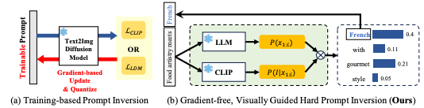

# Visually Guided Decoding (VGD)


**Visually Guided Decoding (VGD)** is a novel gradient-free hard prompt inversion technique for text-to-image generation models. This work has been accepted to ICLR 2025 and sets a new state-of-the-art in the field of textual inversion.

* VGD generates fully interpretable prompts that enhance generalizability across tasks and models in text-to-image generation.


* While conventional prompt inversion techniques update prompt embeddings through gradient-based optimization and quantization, VGD is a gradient-free technique that utilizes large language models and CLIP to generate relevant sentences.




---

## 📄 Paper Information

- **Title**: Visually Guided Decoding: Gradient-Free Hard Prompt Inversion with Language Models
- **Authors**: Donghoon Kim, Minji Bae, Kyuhong Shim, Byonghyo Shim
- **Conference**: ICLR 2025
- **arXiv**: [https://arxiv.org/abs/2505.08622](https://arxiv.org/abs/2505.08622)

---

## 🧠 Overview

VGD leverages the text generation capabilities of large language models (LLMs) combined with CLIP-based visual feedback to generate interpretable and visually-aligned prompts. Unlike prior soft/hard prompt inversion methods, VGD requires no additional training and provides improved interpretability and generalization.

---

## 🚀 Getting Started

To run inference:

```bash
python ./vgd/inference.py --cfg ./config/{taskname}.yaml
```

- Replace `{taskname}` with the name of the YAML config for your desired task.
- See `./vgd/run.sh` for example CLI commands used in our experiments.

---

## 🛠️ Installation

Install required packages using:

```bash
pip install -r requirements.txt
```

---

## 📊 Key Results

### Figure 2: Prompt Generation Pipeline


*VGD generates initial prompts using an LLM and refines them using CLIP-based feedback to maximize visual similarity.*

### Figure 3: Qualitative Comparisons


*Compared to previous prompt inversion methods, VGD achieves higher visual alignment and interpretability.*

---

## 👩‍💻 Authors

- **Donghoon Kim** – [dhkim@islab.snu.ac.kr](mailto\:byonghyo.shim@example.com)
- **Minji Bae** – [mjbae@islab.snu.ac.kr](mailto\:byonghyo.shim@example.com)
- **Kyuhong Shim** – [khshim@skku.edu](mailto\:byonghyo.shim@example.com)
- **Byonghyo Shim** – [bshim@islab.snu.ac.kr](mailto\:byonghyo.shim@example.com)

---

## 📅 Citation

If you use this work, please cite our paper:

```bibtex
@inproceedings{kim2025visually,
  title={Visually Guided Decoding: Gradient-Free Hard Prompt Inversion with Language Models},
  author={Kim, Donghoon and Bae, Minji and Shim, Kyuhong and Shim, Byonghyo},
  booktitle={International Conference on Learning Representations (ICLR)},
  year={2025}
}
```

---

## 📁 Directory Structure

```
vgd/
├── bluestar/
│   ├── data/
│   ├── losses/
│   ├── metrics/
│   ├── models/
│   ├── modules/
│   ├── nn/
│   ├── optim/
│   ├── utils/
│   ├── __init__.py
├── vgd/
│   ├── config/
│   │   ├── {taskname}.yaml
│   ├── run.sh
│   ├── inference.py
│   ├── wrapper.py
│   ├── run.sh
├── requirements.txt
├── README.md
```

---

## 📢 Contact

For questions or issues, feel free to open a GitHub issue or contact the authors directly.

